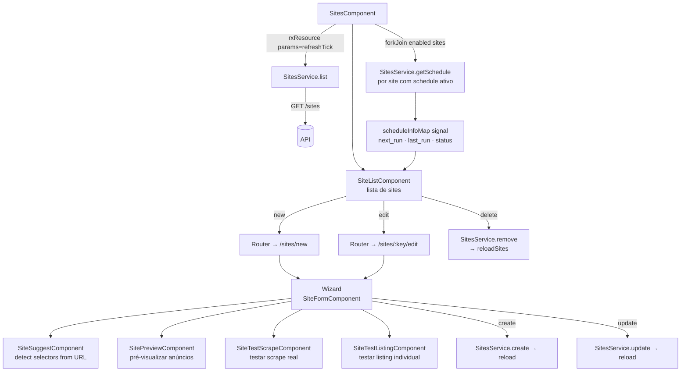
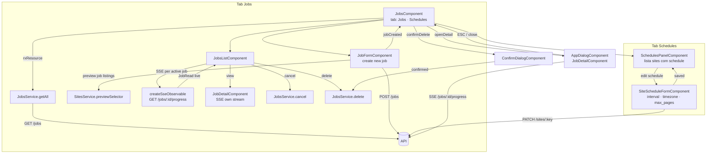
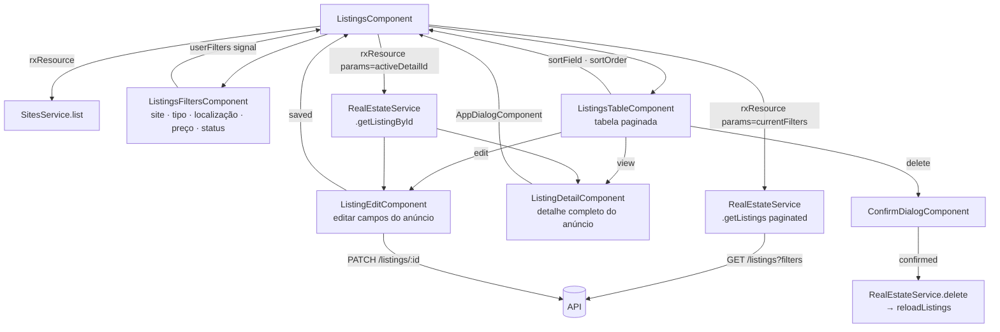
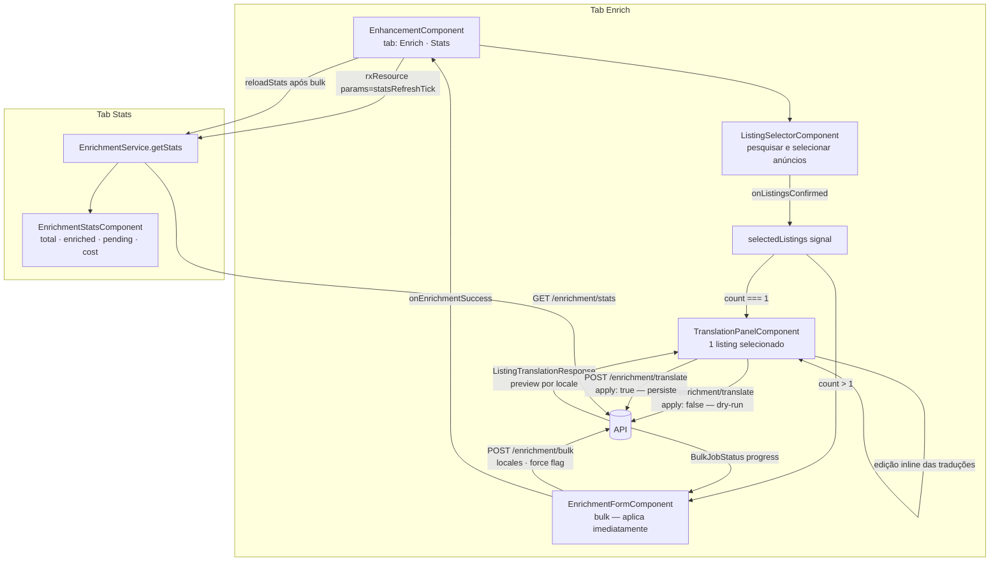
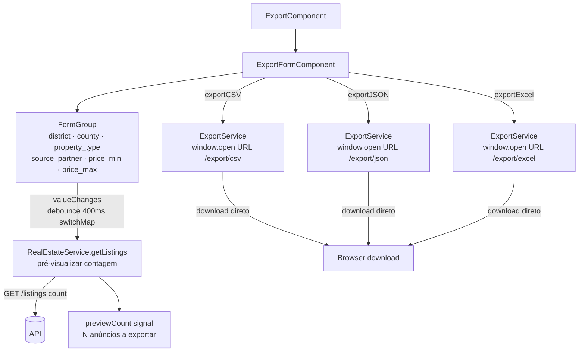
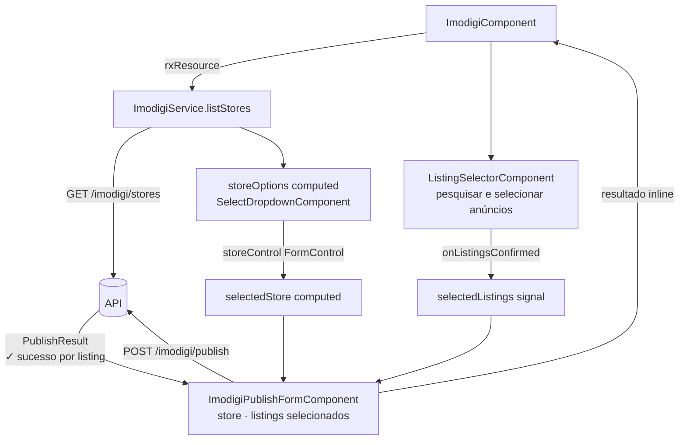
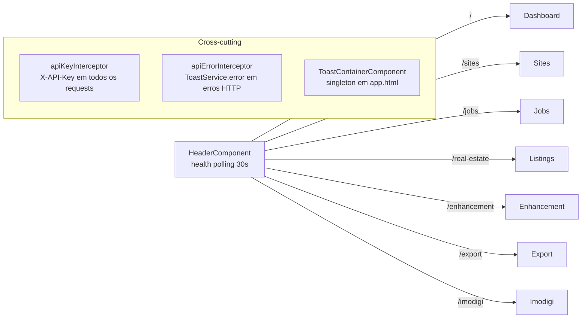

# MVP Scraper Frontend — Diagramas de Arquitetura

> Abrir preview: `Ctrl+Shift+V`

---

## 1. Dashboard

```mermaid
flowchart TD
    DC[DashboardComponent]
    DC -->|rxResource stream| DS[DashboardService\n.partnerStats]
    DS -->|GET /dashboard/partner-stats| API[(API)]
    API -->|PartnerStats[ ]| DS
    DS --> DC

    DC --> SORT[sortColumn / sortDir\nsignal]
    SORT --> P[partners computed\nsort local]
    P --> TBL[Tabela de Parceiros\ntotal · updated · avg_price\nenriched · imodigi · last_job]
    TBL -->|click cabeçalho| SORT
```

---

## 2. Sites



---

## 3. Jobs



---

## 4. Listings



---

## 5. Enhancement (AI Enrichment)



> **Nota:** `EnrichmentPreviewComponent` e `EnrichmentResultComponent` existem no código mas nunca são usados em nenhum template — dead code.

---

## 6. Export



---

## 7. Imodigi (Publicação)



---

## Visão Global — Routing


